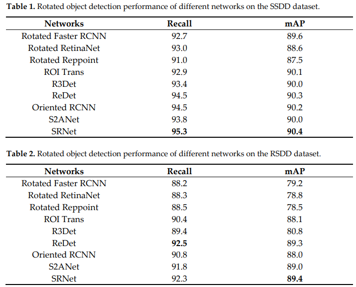
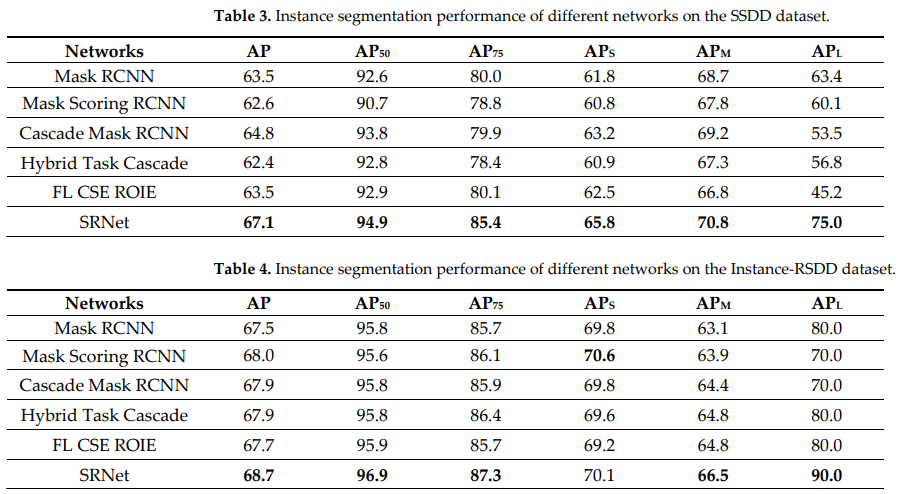

# SRNet

An instance segmentation for ships in SAR images.

Ship instance segmentation in synthetic aperture radar (SAR) images is a hard and challenging task, which not only locates ships but also obtains their shapes with pixel-level masks. But in ocean SAR images, because of the consistent reflective intensities of ships, the appearances of different ships are similar, which makes it far too difficult to distinguish ships when they are in densely packed groups. Especially, when ships have incline directions and large aspect ratios, the horizontal bounding boxes (HB-Boxes) used by all the instance segmentation networks as we know so far are inevitable to contain redundant backgrounds, docks, and even other ships, which mislead the following segmentation. To solve this problem, a novel ship instance segmentation network, called SRNet, is proposed with rotated bounding boxes (RB-Boxes), which are taken as the foundation of segmentation. Along the directions of ships, the RB-Boxes can surround the ships tightly, but a minor deviation will corrupt the integrity of the ships’ masks. To improve the performance of the RB-Boxes, a dual feature alignment module (DAM) is designed to obtain the representative features with the direction and shape information of ships. On account of the difference between the classification task and regression task, two different sampling location calculation strategies are used in two convolutional kernels of the DAM, making these locations distributed dynamically on the ships’ bodies and along the ships’ boundaries. Moreover, to improve the effectiveness of training, a new adaptive Intersection-over-Union threshold (AIoU) is proposed based on the aspect ratio information of ships to raise positive samples. To obtain the masks in the RB-Boxes, a new Mask-segmentation Head (MaskHead) with twice sampling processes is explored. 

In experiments to evaluate the RB-Boxes, the accuracy of the RB-Boxes output from the Detection Head (DetHead) of SRNet outperforms eight rotated object detection networks. 

In experiments to evaluate the final segmentation masks, compared with several classic and state-of-the-art instance segmentation networks, our proposed SRNet, has achieved more accurate ship instance masks in SAR images. 

# How to use

## test the SRNet
1. Setup the mmdetection
2. download this project
3. download the Instance-RSDD dataset
4. download the weights for SRNet
5. modify the dataset path ! ! !
6. python ./tools/test.py ./config/SRNet/SRNet_r50_fpn_3x_SSDD_le90.py ./weights/SSDD.pth --eval mAP --show-dir ./results/SRNet_r50_fpn_3x_SSDD_le90

## train the SRNet
python ./tools/train.py ./configs/SRNet/SRNet_r50_fpn_3x_SSDD__le90.py --work-dir ./log/SRNet_r50_fpn_3x_SSDD_le90

## the best weights files:
please download form : 
###### uploading

## the Instance-RSDD dataset:
we labeled RSDD dataset in instance segmentation level, named Instance-RSDD, which can be used for instance segmentation for ships in SAR images.
the source images of Instance-RSDD dataset:
XU Congan, SU Hang, LI Jianwei, et al. RSDD-SAR: Rotated ship detection dataset in SAR images[J]. Journal of Radars,  in press. doi:  10.12000/JR22007

please download form : 
###### uploading

## please cite our paper:
Yang, X.; Zhang, Q.; Dong, Q.; Han, Z.; Luo, X.; Wei, D. Ship Instance Segmentation Based on Rotated Bounding Boxes for SAR Images. Remote Sens. 2023, 15, 1324. https://doi.org/10.3390/rs15051324
